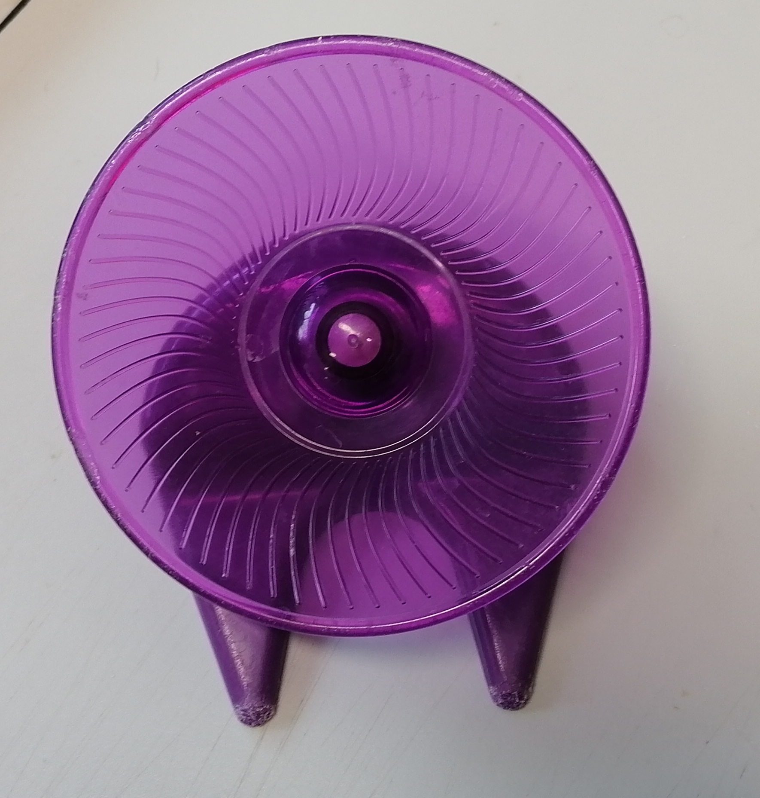
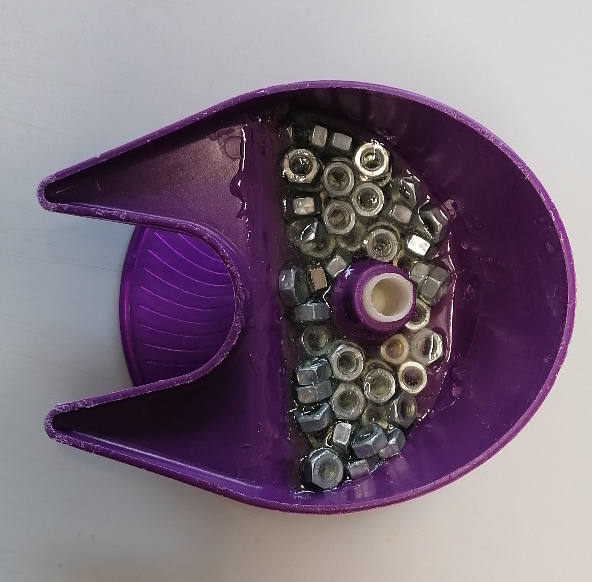

# rodent-tracking
 system to track rodent activity in their home cages

---
### hardware:

#### Camera

This system is based on a [ELP USB camera](<http://www.webcamerausb.com/elp-20mp-1080p-cmos-ov2710-cmos-sensor-infrared-usb-camera-module-with-ir-led-for-day-night-video-surveillance-p-188.html>), they are quite neat because:
- they have automated infrared (IR) system: Luminosity sensors that make the IR mode* kick in automatically. 
  - *LEDs as well as a shutter that removes the IR filter from the front of the CCD sensor when light levels go below a fixed treshold. 
- run up to 120 frames per second. 
- They use lenses on M12 mounts, which means there are many different options available (fish eye, macro, longer focal distances, etc).
- Are fairly inexpensive and can be bought online ([ebay](<https://www.ebay.co.uk/itm/2MP-High-Speed-120fps-IR-24-LED-Night-Vision-USB-No-Driver-Camera-Module-Board/323585108374?ssPageName=STRK%3AMEBIDX%3AIT&_trksid=p2060353.m2749.l2649>), aliexpress, etc).
- They run on any Operating System.

#### Securing camera in place

This camera is secured in place on top of the home cage with a 3D printed adapter, which can be found on [3D_designs](3D_designs). They were printed using a filament printer with PLA, at 20% infill and 0.2mm layer height.

---
### Software:

#### Data Collection and analysis

For data collection we are using [Bonsai-RX](<https://bonsai-rx.org>), which is a visual programming system that makes really easy for non-programmers to click around and get results fairly fast. They have nice tutorials and documentation [here](<https://bonsai-rx.org/resources/>)
  
Very briefly, we used the object tracking tutorials on the bonsai website and relied on the fact that under HSV space and infrared illumination, we could isolate black things and animals very well from the background. The mice are black naturally, and we added a piece of black tape to the wheel, as a tracking marker.

So the tracking pipeline works like this:

1. get camera feed
2. transform colour space from RGB to HSV
3. split the feed into 2, one to track wheel movement, and one to track mouse movement
4. crop the region of interest in each feed
5. set the "find countours" node min and max values so that we track the right object when mouse and wheel are overlapping
6. use the "binary image analysis" and "get largest binary region" to select the object being tracked (step 5 will garantee that the wheel feed will only capture the wheel marker).
7. get the centroid of each field
8. rename the centroid variables in each feed so that it is easier to work with data later.
9. zip everything together and couple it with a "time stamp" node, so we have precise time measurements at each frame.
10. for each x and y centroid values (mouse and wheel), get their first derivative (the movement change in between 2 frames), and divide each by the time elapsed in each frame, to get velocity.
11. get the absolute velocity for each coordinate and set a threshold above zero. Values below the threshold are considered non-movement.
12. set a logical OR for the each coordinate pair. eg for the wheel movement, if there was movement in X OR in Y, we consider the wheel was moving.
13. start preparing variables to be saved to a file - rename a couple of them and zip them together (zipped data, not in order: 
    - timestamps 
    - raw centroids X and Y
    - X and Y velocities for each tracked object 
    - time interval in between frames
    - logical arrays containing information on whether the animal or wheel were moving).
14. feed in the zipped variables into a CSV writer.
15. Both the CSV file and the raw recordings (as .avi files) are being saved to disk
16. We can now use any programming language (I think at this stage even Excel - if it is able to load so many rows :P ) to plot the data. Since all variables were renamed, it should be straightforward knowing what each column on the data represents.

#### Plotting data

(coming soon)

--- 
 #### Notes:

 - one of the first things we noticed is that the running wheels are very light, and when the animals are running on them, they tend to move around in the cage, which is not so good for the tracking.
    - the solution to this problem is to weigh down the wheels, using [M6 nuts](<https://uk.rs-online.com/web/p/hex-nuts/0525919>) and [2-component epoxi](<https://uk.rs-online.com/web/p/epoxy-resins-epoxy-adhesives/1593957/>) on the bottom side of the cages to weigh them down. See images below.

|  ||
|---|---|

